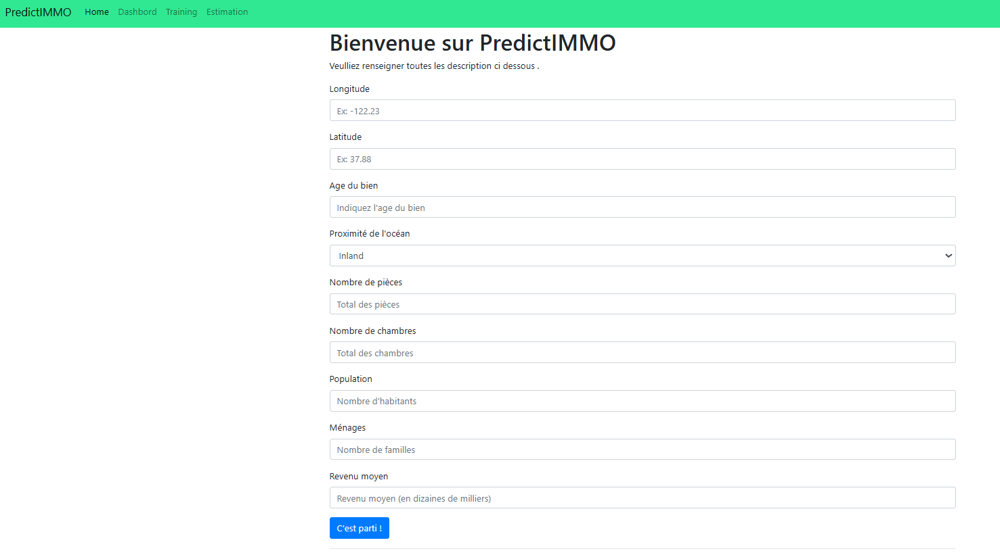
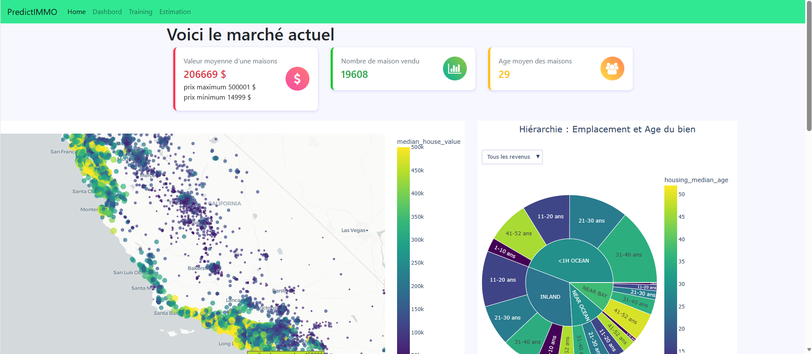
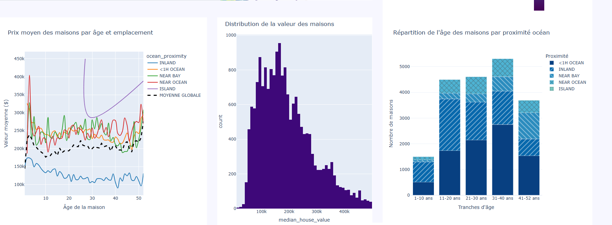
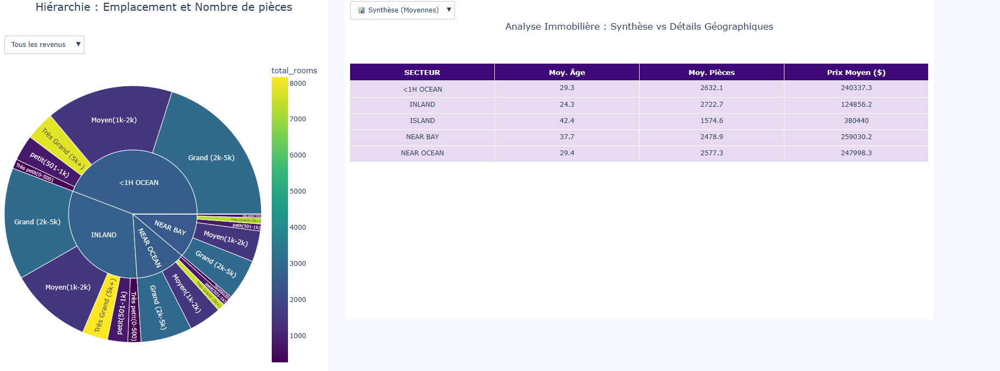

# 🏡 PredictIMMO

# **Application PredictIMMO**

Application web de prédiction de prix immobiliers en Californie, basée sur un modèle de Machine Learning (Random Forest).

---

Cette application permet:
-  aux clients désirant vendre leur biens d'estimer leur bien, a l'aide de notre ai entraîner grace au maison que nous avons vendu;
- a nos agents de voir l'état des ventes et cibler les biens à vendre en fonction des acheteur poussant la porte de notre établissement.

Cette aplication posède 4 onglets:
-Acceuil,
-Dashbord,
-Estimation,
-Training

## 📋 Description

PredictIMMO est une application Flask qui permet à des agents immobiliers d'estimer la valeur d'un bien californien en quelques clics, d'explorer le marché via un dashboard interactif, et aux data scientists de réentraîner le modèle avec de nouvelles données métier.

---

## 🚀 Fonctionnalités

### 🏠 Page d'accueil (`/`)
- Présentation de l'application
- Statistiques clés en temps réel : nombre de transactions analysées et précision du modèle (R²)
- Accès rapide aux différentes pages

Permet de naviguer vers les autres pages


### 🤖 Estimation (`/prediction`)

Cette page permet au client d'estimer la valeur de son biens en fonction du marché passé.( données utilisé par l'AI)
- Formulaire de saisie des caractéristiques du bien (localisation, âge, pièces, population, revenus, proximité océan)
- Sélection de la version du modèle à utiliser parmi toutes les versions disponibles
- Affichage du prix estimé en dollars



### 📊 Dashboard (`/dashbord`)
Cette page mets en avant  les indicateurs par rapport au vente réalisé ( données utilisé pour entrainer l'AI)

- Carte géographique interactive des biens (scatter map)
- Camembert sunburst : hiérarchie emplacement / âge des biens (filtrable par tranche de revenu)


- Histogramme de distribution des valeurs immobilières
- Graphique linéaire des prix moyens par âge et emplacement


- Camembert sunburst : hiérarchie emplacement / nombre de pièces (filtrable par tranche de revenu)
- Tableau hybride synthèse/détail par secteur géographique



### 🔬 Réentraînement du modèle (`/training`) — *Data Scientists*

Cette page permet de réentrainer le model AI avec les nouvelles ventes réalisé afin d'estimé au plus pres la valeur d'un bien.
- Upload d'un nouveau jeu de données CSV
- Fusion automatique avec les données existantes (`housing_1.csv`)
- Réentraînement du modèle Random Forest sur les données combinées
- Comparaison des performances RMSE et R² entre ancien et nouveau modèle
- Validation ou rejet du nouveau modèle
- Sauvegarde automatique des métriques (`metrics.json`)

---

## 🗂️ Structure du projet

```
project/
│
├── app.py                  # Application Flask — routes et logique principale
├── training.py             # Préparation des données et réentraînement du modèle
├── plot.py                 # Fonctions de visualisation Plotly
│
├── model/
│   ├── model_ramdomforest.joblib         # Modèle actif
│   ├── model_ramdomforest_*.joblib       # Archives des modèles réentraînés
│   └── metrics.json                      # Métriques du modèle actif (R², nb transactions)
│
├── templates/
│   ├── base.html           # Template de base (navbar Bootstrap)
│   ├── index.html          # Page d'accueil
│   ├── prediction.html     # Page d'estimation
│   ├── dashbord.html       # Page dashboard
│   └── training.html       # Page réentraînement
│
├── static/
│   └── style.css           # Feuille de styles CSS
│
├── housing_1.csv           # Données d'entraînement de base
├── requirements.txt        # Dépendances Python
└── README.md               # Ce fichier
```

---

## ⚙️ Installation

### 1. Cloner le projet

```bash
git clone <url_du_projet>
cd project-prediction-immo
```

### 2. Créer un environnement virtuel

```bash
python -m venv .venv
.venv\Scripts\activate      # Windows
source .venv/bin/activate   # Mac / Linux
```

### 3. Installer les dépendances

```bash
pip install -r requirements.txt
```

### 4. Lancer l'application

```bash
flask --app app.py run --debug
```

L'application est accessible sur : [http://127.0.0.1:5000](http://127.0.0.1:5000)

---

## 🧠 Modèle Machine Learning

- **Algorithme** : Random Forest Regressor (scikit-learn)
- **Variable cible** : `median_house_value` (prix médian du logement en $)
- **Variables d'entrée** :

| Variable | Description |
|---|---|
| `longitude` / `latitude` | Coordonnées géographiques |
| `housing_median_age` | Âge médian des logements |
| `total_rooms` | Nombre total de pièces |
| `total_bedrooms` | Nombre total de chambres |
| `population` | Population du quartier |
| `households` | Nombre de ménages |
| `median_income` | Revenu médian (en dizaines de milliers de $) |
| `ocean_proximity` | Proximité de l'océan (encodée numériquement) |
| `rooms_per_household` | Pièces par ménage *(variable construite)* |
| `bedrooms_per_room` | Ratio chambres/pièces *(variable construite)* |
| `population_per_household` | Population par ménage *(variable construite)* |

### Encodage de `ocean_proximity`

| Valeur | Code |
|---|---|
| INLAND | 0 |
| ISLAND | 1 |
| NEAR BAY | 3 |
| <1H OCEAN | 4 |
| NEAR OCEAN | 2 |

---

## 📦 Dépendances principales

| Librairie | Utilisation |
|---|---|
| `flask` | Framework web |
| `pandas` | Manipulation des données |
| `numpy` | Calculs numériques |
| `scikit-learn` | Modèle ML et métriques |
| `joblib` | Sauvegarde et chargement du modèle |
| `plotly` | Visualisations interactives |

---

## 👨‍💻 Auteur

Projet réalisé par E.SOFACK dans le cadre du module manger la donnée - M1 Data Manager
